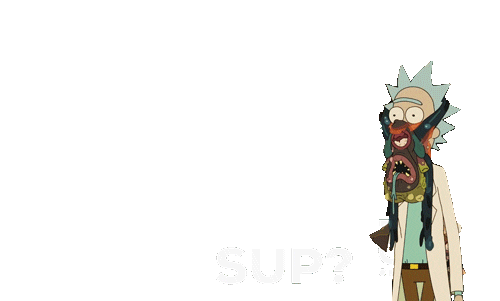
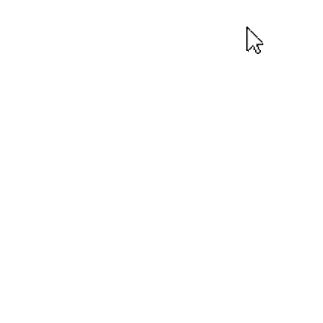
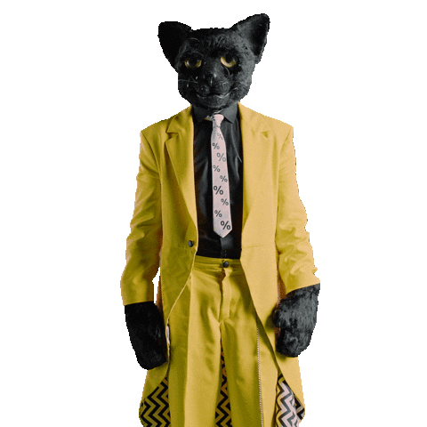
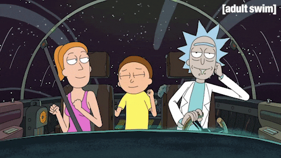

<body>
<h1 align="center"> ⬇️ 𝙒𝙚𝙡𝙘𝙤𝙢𝙚 𝙩𝙤 𝙢𝙮 𝙥𝙧𝙤𝙛𝙞𝙡𝙚 ⬇️ </h1>
 

 

<h2 align="center"> 💬 𝘼𝙗𝙤𝙪𝙩 𝙢𝙚 🗨️ </h2>

<li>
<b>Full-Name:</b> <h4><b>Nguyen Lam Quoc Ty</b></h4> </li>
<li>
<b>Gender:</b> Male, boy!
</li>
<li>
<b>Hobbies:</b> Coding, web development, solve algorithm puzzles, documentaries, games, old/new school rap, reading and Cats 
</li>
 

<b>     Thanks for reading about my personal stuff 
                                 💯❤️‍🔥</b>

<h2 align="left">            📇 𝙆𝙣𝙤𝙬𝙡𝙚𝙙𝙜𝙚/ 𝙆𝙣𝙤𝙬𝙣 𝙖𝙗𝙤𝙪𝙩 📇</h2>

        

     
    

 
 
 
 

I'm mostly work with <b><i>CSS, HTML, Typescript</i></b> and <b><i>Angular</i></b> at the <b>Front-end</b> and <b><i>ASP.NET Framework, MSSQL Server</i></b> at the <b>Back-end</b> and deploy on <b> Vercel</b>

 
<h2 align="center">⌨️ 𝙒𝙤𝙧𝙠 𝙀𝙭𝙥𝙚𝙧𝙞𝙚𝙣𝙘𝙚 🖱️</h2>

 
 
 
I used to take part as a <i><ins>Full-stack Web Developer Intern</ins></i> at <b><strong>Restaff House of Norway</strong></b> in Internship Program

 
<h2 align="right">📝 𝘾𝙤𝙣𝙩𝙖𝙘𝙩 𝙢𝙚 📝            </h2>

 

Here are some of my   
most used social info ヽ(o＾▽＾o)ノ

   📱: (+84) 93 356 2450

 

 
 
 
 
 
 
 
 
 
 
 

    <h2 align ="center">⚔️ Stats 𝙇𝙀𝙑𝙀𝙇 𝙐𝙋! 🛡️</h2>
    
     
    
     
     
     
     
     
     
    

 
 
 
 
 
 
 
 
 
 
 
 
 
 
 

<h2 align="center">💖 𝙏𝙝𝙖𝙣𝙠𝙨 𝙛𝙤𝙧 𝙬𝙖𝙡𝙠𝙞𝙣𝙜 𝙩𝙝𝙧𝙤𝙪𝙜𝙝 𝙢𝙮 𝙥𝙧𝙤𝙛𝙞𝙡𝙚! 💖</h2>

</body>
